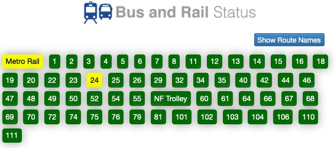

But there is route `17` in the data.

## Data format

The format of the data file is as follows,

### columns:

    'vehicle_id'
    'route_id_curr': the route number,
    'direction': 0, 19, 20
    'block_id'
    'service_type'
    'deviation'
    'next_tp_est':
    'next_tp_sname':
    'next_tp_sched':
    'X':
    'Y':
    'location time':
    'route logon id'
    'block_num'
    'off route'
    'run_id'

## Process data

1. Remove the last comma
1. Remove the rows that have `vehicle_id >= 8000`
   - what are these?
1. Remove the rows that have `route_id_curr == 0`
   - what are these?
1. Remove the rows that have `route_id_curr > 111`
1. Remove the rows that have `location time` out of time range that we are interested in, e.g., 6am to 9pm
1. The columns that we actually care about are: `vehicle_id`, `route_id_curr`, `block_id`, `next_tp_est`, `next_tp_sname`, `next_tp_sched`, `X`, `Y`, `location time`

The bus might stop at some location for a long period
